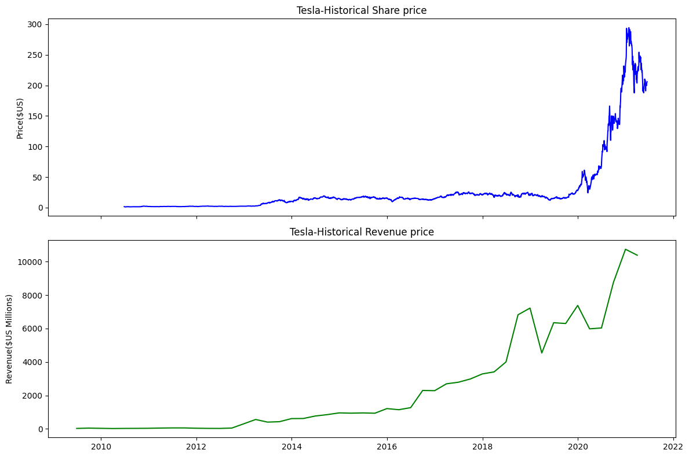
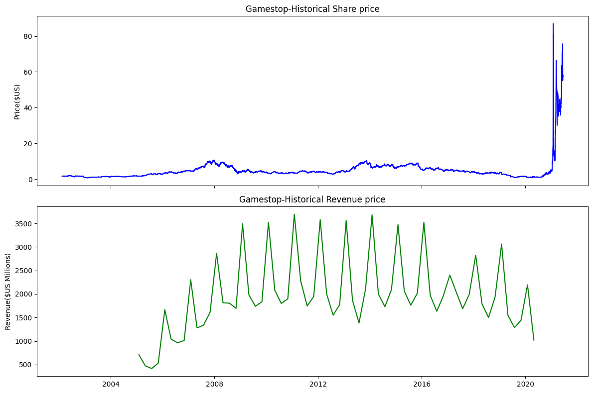

# Tesla & GameStop Stock and Revenue Analysis

## Project Overview

This project analyzes the historical stock prices and quarterly revenue of Tesla and GameStop using Python. The objective is to collect financial data, clean and process the datasets, and visualize stock price and revenue trends over time.

## Objectives

- Extract historical stock price data for Tesla and GameStop.
- Extract quarterly revenue data.
- Clean and prepare the datasets using Pandas.
- Visualize stock price and revenue trends.
- Compare stock price movements with revenue trends.

## Tools & Technologies

- Python
- Pandas
- yfinance
- Matplotlib
- Jupyter Notebook

## Companies Analyzed

### Tesla (TSLA)

Historical stock price and quarterly revenue data were analyzed to identify trends and changes over the analyzed period.

### GameStop (GME)

Historical stock price and quarterly revenue data were analyzed to identify trends and changes over the analyzed period.

## Project Workflow

The project follows these main steps:

1. Extract historical stock data using `yfinance`
2. Extract quarterly revenue data
3. Clean and prepare the datasets using Pandas
4. Create stock price and revenue visualizations using Matplotlib
5. Analyze and interpret the observed trends

## Visualizations
### Tesla

### GameStop

## Analysis & Findings

### Tesla

- Tesla's stock price remained relatively low during the early part of the period before experiencing several periods of growth and decline.
- From 2020 onward, Tesla's stock price increased substantially and reached its highest level near the end of the analyzed period before declining from its peak.
- Tesla's revenue remained relatively low and stable during the early years.
- Revenue increased substantially during the later part of the analyzed period.
- Overall, Tesla's stock price and revenue showed an upward trend, although their movements were not identical.

### GameStop

- GameStop's stock price experienced several periods of growth and decline throughout the analyzed period.
- After declining for several years, the stock price experienced a substantial increase shortly after 2020.
- GameStop's revenue increased substantially during the earlier part of the analyzed period but continued to fluctuate over time.
- From around 2016 onward, revenue showed an overall downward trend despite continued fluctuations.
- Toward the end of the analyzed period, GameStop's stock price and revenue showed different trends, with the stock price increasing substantially while revenue remained on a weaker overall trend.

## Conclusion

This project provided practical experience in collecting, cleaning, analyzing, and visualizing financial data using Python.

The analysis showed that Tesla's stock price and revenue generally followed an upward trend over the analyzed period, while GameStop displayed a more varied relationship between stock price and revenue.

## Project Files

- `Tesla_GameStop_Analysis.ipynb` — Jupyter Notebook containing the complete analysis and visualizations.

## Future Improvements

- Add interactive visualizations using Plotly.
- Calculate stock returns and revenue growth rates.
- Analyze stock-price volatility.
- Compare the companies using additional financial metrics.
- Build an interactive dashboard using Power BI or Streamlit.
